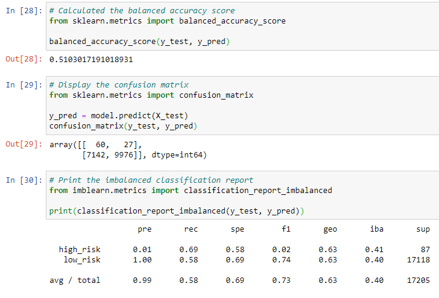
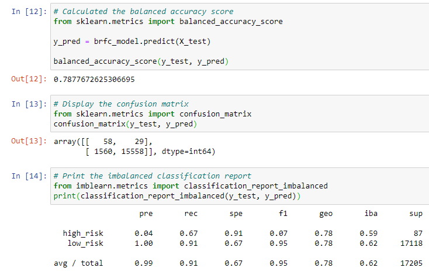

# Credit_Risk_Analysis

## Overview of the loan prediction risk analysis:
Credit risk is an inherently unbalanced classification problem, as good loans easily outnumber risky loans. Therefore, I will employ different techniques to train and evaluate models with unbalanced classes. I will use imbalanced-learn and scikit-learn libraries to build and evaluate models using resampling.

Using the credit card credit dataset from LendingClub, a peer-to-peer lending services company, I will oversample the data using the RandomOverSampler and SMOTE algorithms, and undersample the data using the ClusterCentroids algorithm. Then, I will use a combinatorial approach of over- and undersampling using the SMOTEENN algorithm. I will then compare two new machine learning models that reduce bias, BalancedRandomForestClassifier and EasyEnsembleClassifier, to predict credit risk. Then I will evaluate the performance of these models and make a written recommendation on whether they should be used to predict credit risk.

## Results
For each of the six machine learning models I used I will be displaying my accuracy score, precision, and recall scores for each. The six models include the Naive Random Oversampling model, the SMOTE Oversampling model, an Undersampling model, a Combination model, a Balanced Random Forest Classifier model, and an Easy Ensemble AdaBoost Classifier model. The results for each of these models will be shown below.

## Summary

* NAIVE Random Oversampling
    * Balanced Accuracy Score: 
  

  
* SMOTE Oversampling
  * Balanced Accuracy Score:
 

  
* Undersampling
  * Balanced Accuracy Score:
  

  
* Combination (Oversampling and Undersampling)
  * Balanced Accuracy Score:
  

  
* Balanced Random Forest Classifier
  * Balanced Accuracy Score:
  

  
* Easy Ensemble AdaBoost Classifier
  * Balanced Accuracy Score:
  

